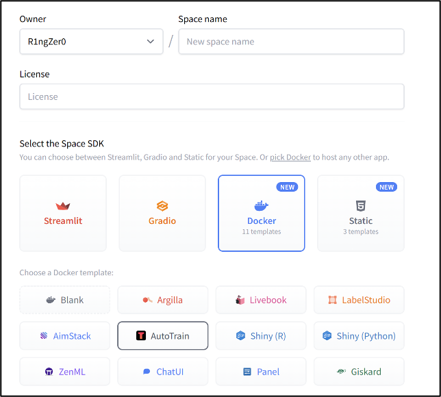

# How to Use `dataset_generator.py`

1. Install Python 3.11 or later.

2. Install the Openai Python library:

```
pip install openai
```

3. Prepare your data and enter it into data.txt or copy/paste a PDF document into the same folder as the script. (NOTE: be sure to change the name of the file at the line in the script where the dat file is referenced.)

```
# Upload a file to use for the assistant
file = client.files.create(
  file=open("data.txt", "rb"), # Change the file name (data.txt) as needed
  purpose='assistants'
)
```

4. Run the script.

```
python dataset_generatory.py
```

# How to Fine-tuning LLMs for cybersecurity with Hugging Face’s AutoTrain

Hugging Face's AutoTrain represents a leap forward in the democratization of AI, enabling users from various backgrounds to train state-of-the-art models for diverse tasks, including Natural Language Processing (NLP) and Computer Vision (CV). This tool is particularly beneficial for cybersecurity professionals who wish to fine-tune LLMs for specific cybersecurity tasks, such as analyzing threat intelligence or automating incident response, without delving deep into the technical complexities of model training. AutoTrain's user-friendly interface and no-code approach make it accessible not just to data scientists and ML engineers but also to non-technical users. By utilizing AutoTrain Advanced, users can leverage their own hardware for faster data processing, control hyperparameters for customized model training, and process data either in a Hugging Face Space or locally for enhanced privacy and efficiency.

## Getting ready

Before utilizing Hugging Face AutoTrain for fine-tuning LLMs in cybersecurity, ensure you have the following setup:

* **Hugging Face account:** Sign up for an account on Hugging Face if you haven't already (https://huggingface.co/)
* **Familiarity with cybersecurity data:** Have a clear understanding of the type of cybersecurity data you wish to use for training, such as threat intelligence reports, incident logs, or policy documents
* **Dataset:** Collect and organize your dataset in a format suitable for training with AutoTrain
* **Access to AutoTrain:** You can access AutoTrain through its advanced UI or use the Python API by installing the autotrain-advanced package

This preparation will enable you to effectively utilize AutoTrain for fine-tuning models to your specific cybersecurity needs.

## How to do it…

AutoTrain by Hugging Face simplifies the complex process of fine-tuning LLMs, making it accessible for cybersecurity professionals to enhance their AI capabilities. Here's how to leverage this tool for fine-tuning models specific to cybersecurity needs:

1.	Prepare your dataset. Create a CSV file with dialogue simulating cybersecurity scenarios:


```
human: How do I identify a phishing email?
bot: Check for suspicious sender addresses and urgent language. 

human: Describe a SQL injection.
bot: It's a code injection technique used to attack data-driven applications. 

human: What are the signs of a compromised system?
bot: Unusual activity, such as unknown processes or unexpected network traffic. 

human: How to respond to a ransomware attack?
bot: Isolate the infected system, do not pay the ransom, and consult cybersecurity professionals. 

human: What is multi-factor authentication?
bot: A security system that requires multiple methods of authentication from independent categories. 
```


2.	Navigate to the Hugging Face Spaces section and click Create new Space.


3.	Name your space, and then select Docker and AutoTrain.





4.	In your Hugging Face settings, create a write token.


The following screenshot shows the area where the token is created.


5.	Configure your options and select your hardware. I recommend keeping it private, and choose the hardware you can afford. There is a free option. You will need to enter your write token in here as well.


6.	Select the fine-tuning method. Choose a fine-tuning method based on your needs. AutoTrain supports Causal Language Modeling (CLM) and, soon, Masked Language Modeling (MLM). The choice depends on your specific cybersecurity data and the expected output:

    * CLM is suitable for generating text in a conversational style
    * MLM, which will be available soon, is ideal for tasks such as text classification or filling in missing information in sentences

7.	Upload your dataset and start training. Upload the prepared CSV file to your AutoTrain space. Then, configure the training parameters and start the fine-tuning process. The process involves AutoTrain handling the data processing, model selection, and training. Monitor the training progress and make adjustments as needed.


8.	Evaluate and deploy the model. Once the model is trained, evaluate its performance on test data. Ensure that the model accurately reflects cybersecurity contexts and can respond appropriately to various queries or scenarios. Deploy the model for real-time use in cybersecurity applications.

## How it works…

Model fine-tuning in general involves adjusting a pre-trained model to make it more suitable for a specific task or dataset. The process typically starts with a model that has been trained on a large, diverse dataset, providing it with a broad understanding of language patterns. During fine-tuning, this model is further trained (or fine-tuned) on a smaller, task-specific dataset. This additional training allows the model to adapt its parameters to better understand and respond to the nuances of the new dataset, improving its performance on tasks related to that data. This method leverages the generic capabilities of the pre-trained model while customizing it to perform well on more specialized tasks.

AutoTrain streamlines the process of fine-tuning LLMs by automating the complex steps involved. The platform processes your CSV-formatted data, applying the chosen fine-tuning method, such as CLM, to train the model on your specific dataset. During this process, AutoTrain handles data pre-processing, model selection, training, and optimization. By using advanced algorithms and Hugging Face's comprehensive tools, AutoTrain ensures that the resulting model is optimized for the tasks at hand, in this case, cybersecurity-related scenarios. This makes it easier to deploy AI models that are tailored to unique cybersecurity needs without requiring deep technical expertise in AI model training.

## There’s more…

In addition to fine-tuning models for cybersecurity tasks, AutoTrain offers several other advantages and potential uses:

* Expanding to other cybersecurity domains: Beyond analyzing dialogue and reports, consider applying AutoTrain to other cybersecurity domains, such as malware analysis, network traffic pattern recognition, and social engineering detection
* Continuous learning and improvement: Regularly update and retrain your models with new data to keep up with the evolving cybersecurity landscape
* Integrating with cybersecurity tools: Deploy your fine-tuned models into cybersecurity platforms or tools for enhanced threat detection, incident response, and security automation
* Collaboration and sharing: Collaborate with other cybersecurity professionals by sharing your trained models and datasets on Hugging Face, fostering a community-driven approach to AI in cybersecurity
These additional insights emphasize AutoTrain's versatility and its potential to significantly enhance cybersecurity AI capabilities.
